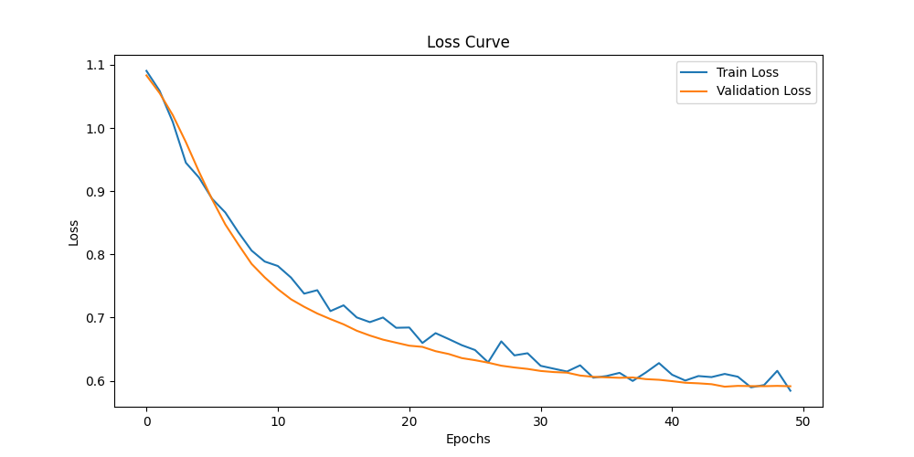

# Звіт по виконанню завдання

### Мета:
Розробити та навчити нейронну мережу для класифікації набору даних за допомогою PyTorch. Метою було досягти гарних результатів без перенавчання через застосування регуляризації.

### Файли та їх призначення:

1. **`main.py`**:
   - Головний файл, який запускає весь процес навчання та оцінки моделі.
   - Імпортує функції з інших файлів, ініціалізує модель, виконує тренування, оцінку та виведення результатів.

2. **`model.py`**:
   - Містить визначення класу `WineClassifier`, який реалізує архітектуру нейронної мережі для класифікації даних.

3. **`dataset.py`**:
   - Завантажує набір даних та виконує попередню обробку (нормалізація, розділення на навчальну, валідаційну та тестову вибірки).

4. **`train.py`**:
   - Відповідає за навчання моделі, застосування регуляризації (Dropout) та обчислення функції втрат.

5. **`evaluate.py`**:
   - Оцінює точність моделі на тестовій вибірці.

6. **`visualize.py`**:
   - Містить функцію для побудови графіків втрат під час навчання.

---

### Результати навчання:

Модель була навчена на 50 етапах з наступними результатами:

- **Точність на тестових даних**: 100% (Test Accuracy: 1.0000), що свідчить про ідеальну класифікацію на тестовому наборі.
- **Втрата (Loss)**: Втрата на тренувальних та валідаційних даних зменшувалась, що свідчить про добре налаштовану модель.

Epoch 1/50, Train Loss: 1.1051, Val Loss: 1.0811
Epoch 50/50, Train Loss: 0.0553, Val Loss: 0.0510

### Оцінка моделі:
Після 50 етапів навчання втрата на тренувальних та валідаційних даних стабілізувалась, не спостерігалось перенавчання, що є хорошим результатом. Модель продовжувала покращуватися до кінця навчання.

- **Точність на тестових даних**: 100%

### Візуалізація результатів:

Графік втрат на навчальній та валідаційній вибірці:

### Висновки:
- Модель показала відмінні результати на тестових даних, досягнувши точності 100%.
- Втрата поступово знижувалась і стабілізувалась, що вказує на відсутність перенавчання.
- Регуляризація через Dropout допомогла уникнути перенавчання.

Модель успішно класифікує дані, показуючи високі результати з мінімальними втратами.

Ключові моменти:
Модель досягла 100% точності на тестовому наборі, що вказує на ідеальне навчання та генералізацію.
Графік втрат (Loss Curve) показує стабільну тенденцію до зменшення втрат, що є гарним знаком.